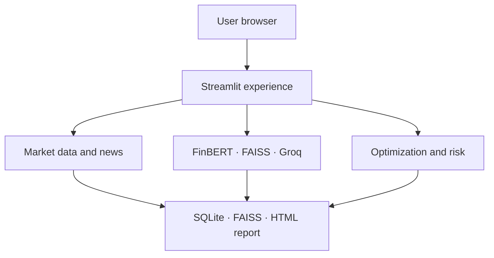
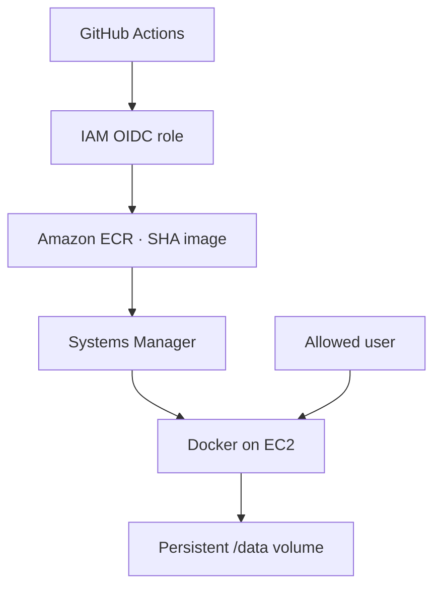

# AXIOM Portfolio Intelligence — System Architecture

## Overview

**AXIOM Portfolio Intelligence** is the customer-facing product name. The GitHub repository is **AXIOM-Portfolio-Intelligence**.

AXIOM combines market-price analytics, adaptive Modern Portfolio Theory, financial-news sentiment, risk analysis, FAISS retrieval, and Groq-generated explanations in one Streamlit workflow. The verified public deployment runs the Streamlit service directly in Docker on AWS EC2. FastAPI is an optional interface rather than a mandatory hop in the deployed request path.

## Architecture goals

- provide an explainable portfolio-research workflow
- keep quantitative results usable when optional AI services fail
- persist users, holdings, and analysis history across container recreation
- expose assumptions, risk, news, and generated recommendations together
- support local Python, Docker, and AWS EC2 environments
- keep components replaceable for future managed-service migration

## High-level logical architecture



## Main analysis sequence

1. The user selects a stored portfolio and starts analysis.
2. The application fetches approximately one year of price history.
3. Prices are aligned by date and converted into daily returns.
4. The optimizer builds an equal-weight baseline and candidate efficient frontier.
5. Recent news is fetched per ticker when a valid NewsAPI key is configured.
6. FinBERT produces article-level and aggregated sentiment scores.
7. The adaptive layer evaluates quantitative quality, sentiment coverage, risk, alpha, and concentration constraints.
8. The selected allocation is passed to the risk analyzer.
9. FAISS retrieves relevant context for each ticker.
10. LangChain and Groq produce concise recommendation narratives when enabled.
11. Results are stored in SQLite and rendered as charts, risk gauges, headlines, and recommendations.
12. The report generator creates a self-contained HTML report.

## Component responsibilities

### Streamlit experience layer

The `frontend/` package provides:

- login and registration workflows
- portfolio and holdings management
- analysis controls and orchestration
- allocation and efficient-frontier charts
- risk metrics and gauges
- correlation and volatility views
- FinBERT sentiment and recent headlines
- AI recommendation presentation
- saved-run history
- benchmark/compare workflow
- downloadable HTML reports

Streamlit session state coordinates the current user and analysis workflow. Durable data must be stored in SQLite rather than relying only on session state.

Local identities are stored with bcrypt password hashes. Accounts created by an
older build may contain SHA-256 hashes; these are accepted once and upgraded to
bcrypt after a successful login. Password hashes are never returned in user
records. The former username-and-email-only password reset is disabled because
it did not prove control of the email account.

### Market-data layer

The market-data modules under `src/data/` are responsible for:

- downloading price history with `yfinance`
- normalizing ticker symbols and company names
- aligning assets by trading date
- computing daily returns with explicit missing-value handling
- returning clear failures for invalid or insufficient data

Adjusted prices should be used consistently so splits and distributions do not create false return jumps.

### News layer

The NewsAPI integration:

- builds a ticker/company query
- requests recent English-language financial news
- normalizes article metadata
- deduplicates headlines or URLs
- exposes provider failures without stopping quantitative analysis

API keys must be validated for presence and format. A value containing multiple comma-separated keys is invalid and can produce HTTP `401` responses.

### FinBERT sentiment layer

FinBERT classifies financial text as positive, negative, or neutral. The application aggregates article-level scores into a ticker-level signal.

Important limitations:

- confidence is not automatically calibrated probability
- duplicate or sensational headlines can dominate aggregation
- coverage differs across companies
- missing news is not evidence of neutral sentiment
- inference can be slow during CPU cold start

### Portfolio optimization layer

For weights `w`, expected returns `mu`, and covariance `Sigma`:

```text
Expected return = w.T @ mu
Variance        = w.T @ Sigma @ w
Sharpe ratio    = (expected return - risk-free rate) / volatility
```

The optimizer applies full-investment and no-short/concentration constraints. AXIOM also evaluates an equal-weight baseline and adaptive blend settings rather than displaying one unexplained weight vector. The repository includes a leakage-aware walk-forward evaluation with drift-adjusted turnover, complete traded notional, transaction costs, and separate gross and net NAV.

MPT outputs are sensitive to historical estimates. Recommended future improvements include covariance shrinkage, explicit turnover-constrained optimization, robust covariance estimation, broader out-of-sample universes, and more extensive capacity/stress testing.

### Risk layer

The risk analyzer calculates or presents:

- annualized volatility
- 95% and 99% Value at Risk
- maximum drawdown
- Sharpe ratio
- correlation matrix
- per-ticker volatility
- concentration diagnostics

No single metric fully describes risk. VaR does not measure losses beyond its threshold, and volatility treats upside and downside movement similarly.

### FAISS and RAG layer

FAISS stores and searches embedded financial context. The RAG pipeline combines retrieved articles with sentiment, allocation, and risk information before calling Groq through LangChain.

The current default model is configured through:

```env
GROQ_MODEL=openai/gpt-oss-120b
```

RAG improves grounding but does not prevent hallucination. Retrieved news is untrusted input and must be delimited, escaped in reports, and prevented from controlling tools or system instructions.

### Persistence layer

The current SQLite schema includes the following main entities:

| Entity | Responsibility |
| --- | --- |
| `users` | Local application identities |
| `portfolios` | User-owned portfolio metadata |
| `holdings` | Tickers, quantity, price, currency, and purchase date |
| `optimization_runs` | Stored metrics, weights, sentiment, recommendations, and risk output |

The container uses:

```text
DB_DIR=/data
FAISS_INDEX_PATH=/data/faiss_index
```

Docker mounts a named volume at `/data`, allowing SQLite and FAISS data to survive container recreation.

## Deployed AWS architecture



Infrastructure is provisioned by `deploy/aws/ec2-stack.yaml`. The CloudFormation stack name is `portfolio-optimizer`; this technical name does not need to match the product brand.

### Current operational characteristics

- single EC2 host
- single Streamlit container
- persistent Docker volume
- HTTP access on port `8501`
- security-group access restricted by `AllowedCidr`
- bootstrap log at `/var/log/portfolio-bootstrap.log`
- container health endpoint at `/_stcore/health`
- CI-built ECR images tagged with the full Git commit SHA
- GitHub Actions authentication through IAM OIDC rather than static AWS keys
- remote deployment through Systems Manager rather than CI-managed SSH keys
- automatic application-image restoration when the new container fails health

### Capacity lesson

A `t3.micro` instance experienced resource pressure and SSH banner timeouts during model/container workloads. `t3.small` improved stability, but FinBERT cold starts can still be resource intensive. Monitor memory, swap, CPU, disk, and container restart counts.

## Optional FastAPI architecture

When the API profile is enabled, FastAPI can provide a programmatic interface:

```text
API client → FastAPI :8000 → shared src modules → SQLite/external providers
```

The public Streamlit deployment should not be documented as requiring this API unless the compose file and runtime actually route Streamlit through it. Generated OpenAPI documentation is the authoritative route contract.

FastAPI uses bearer JWTs signed by the required `SECRET_KEY`. Token subjects are
resolved against the current database user on every protected request. Portfolio
lookups and mutations are scoped by both resource ID and authenticated user ID;
an inaccessible resource returns `404` to avoid disclosing another user's data.
Browser origins are restricted through `CORS_ORIGINS` rather than a wildcard.

## Failure behavior

| Failure | Expected behavior |
| --- | --- |
| Invalid ticker | Exclude with warning or stop before optimization |
| NewsAPI unavailable | Continue quantitative analysis without fresh sentiment |
| FinBERT unavailable | Continue with quantitative-only results |
| FAISS unavailable | Skip retrieval and do not claim grounded generation |
| Groq unavailable | Show deterministic fallback; preserve risk/weight outputs |
| SQLite write failure | Surface the error; do not claim the run was saved |
| EC2 resource pressure | Health alert, inspect logs/metrics, resize or optimize |

## Security boundaries

- browser to Streamlit
- Streamlit/container to external market, news, and LLM providers
- container to SQLite/FAISS volume
- administrator to EC2 through SSH
- CI/deployment identity to AWS

Use TLS, least-privilege IAM, managed secrets, rate limits, output escaping, and structured logs. Passwords currently use bcrypt, and legacy SHA-256 hashes are upgraded after successful authentication.

## Production evolution

| Current design | Recommended evolution |
| --- | --- |
| Public HTTP and changing EC2 IP | Domain, Elastic IP where appropriate, and HTTPS |
| `.env` secrets | AWS Secrets Manager or SSM with IAM roles |
| Single EC2 | Load-balanced managed container service or autoscaling group |
| SQLite | RDS PostgreSQL with migrations and backups |
| Local FAISS | Versioned shared vector storage or managed vector service |
| Manual logs | CloudWatch metrics, logs, traces, dashboards, and alarms |
| ECR image rollback | Add a separately auditable operator-selected rollback workflow |

## Architectural principles

1. Quantitative results should survive optional AI-provider failure.
2. Historical runs should preserve the assumptions and evidence used to create them.
3. Product branding should remain separate from infrastructure identifiers.
4. Generated recommendations should be treated as explanations, not trade commands.
5. Claims in documentation must be reproducible from committed code and stored artifacts.
